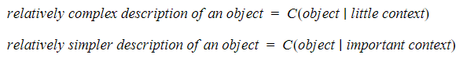
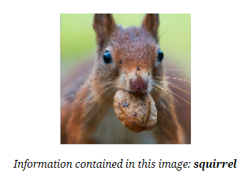
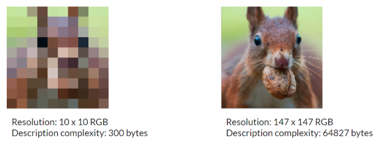
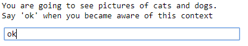
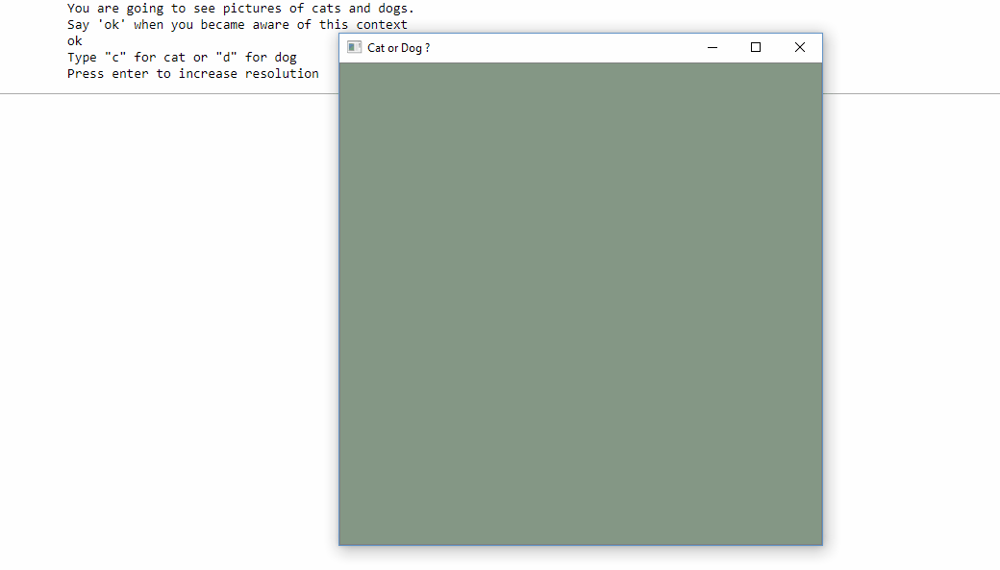
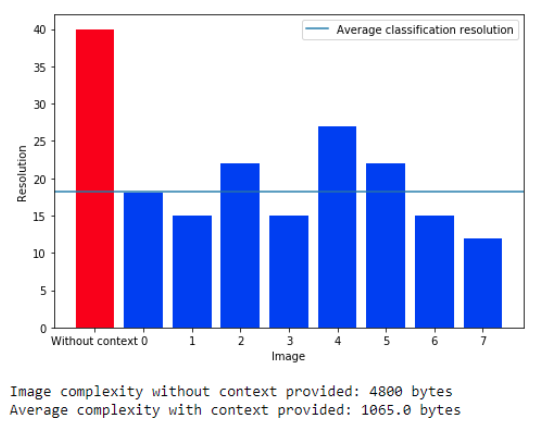

# Quick experiment: Impact of Context for Image Recognition
  
In [Kolmogorov's sense of complexity](https://en.wikipedia.org/wiki/Kolmogorov_complexity), conditional complexity allows to take some background knowledge into account for description complexity.  
  
Can this concept be applied to image recognition?  
  
I did a quick experiment to try to highlight this process in the context of image recognition.  
  
## Reminder: Conditional Complexity
The complexity of description (called also Kolmogorov complexity) is the minimal number of information bits needed to describe a given object.  
  
With this definition, we talk about conditional complexity when we allow the use of background knowledge in the way we encode our information. The advantage of doing it this way is important: the object will be less complicated to describe using this context, and therefore of less complexity.  
  
The more information in the context, the lower the description complexity of the object. On the contrary, with fewer context, the description will be more complex.  

  
  
## Description complexity for an image  

I’ve been trying to transpose this phenomenon to image recognition by human. I started by defining the information contained in an image for my experiment. I defined it as follows:  
  
**Information in the image**: name of the element represented in the image.  
  
  
  
I therefore focused on images that contain only one recognizable subject. Once we have defined the information that can be contained in an image, we can define the complexity of the description of that image:  

**Description complexity**: size in bytes of the image encoded with the minimum resolution to be correctly named.  
  
  
  
**Note**: *the aim of the experiment is not to achieve lossless compression of the original image. We remind you that here the information contained in the image is not the pixels of the original image, but the name of the element contained in the image.*  
  
With these two definitions, we will look at the impact of context on the description complexity of images. If we draw a parallel with conditional complexity, a larger context about the information that may be contained in an image should result in a lower description for this image, and therefore a lower resolution. On the other hand, without any context provided for an observer, one would need a higher resolution to be able to name correctly what is contained in the image.  
  

## The Experiment  
  
Images of cats and dogs will be shown to an observer. **The program retrieves random images from the internet, so that the viewer will normally never have seen any of these images**.  
  
For an observer, the experience takes place in two steps.  
  
### 1. Observation of an image without context  
  
  
  
At this stage, the observer isn’t aware of what he is going  to observe. A first image in its lowest resolution (1 pixel) is presented to the observer. He can either iteratively increase the resolution of the image, or validate the fact that he can correctly name what he sees in the image. The observer will therefore gradually increase the resolution until he recognizes the information contained in the image. This first chosen resolution is the **image recognition resolution without context**.  
  
### 2. Classification task of images with context provided  
  
The observer is then informed of a context in which the following images will be observed: this is a cat and dog classification task.  
  
  
  
Other images are then presented to the observer. For each of them, the resolution is initially minimal (1 pixel). Like in the first part, the observer can gradually increase the resolution. When he is confident enough about what he can observe in the image, he will be able to classify it. This task of classification is therefore carried out with an “**image recognition resolution with context**". If the observer classifies enough images correctly, his results can be taken into account and an “**average image recognition resolution with context**” is obtained.  
  
  
  
### Expected Results  
  
Following the idea of conditional complexity presented at the beginning, it is expected that the resolution needed to retrieve the information contained in the image without context will be higher than the average resolution needed in the situation where a context has been provided to the observer.  
  
## Results  
  
For the different people I gave the test to, the results were pretty much in line with the expected results. You can see an example of these results below.  
  
  
  
It can be seen that the resolution needed to recognize the information in the first image is clearly more important than the following resolutions. With some context, we've reduced the description complexity of the images for the classification task!  
  
For about ten people and by taking into account only the results with a precision higher than 0.8 in the classification task, I obtained the following average results:  
  
|                          | Without Context | With Context  |
| ------------------------ |:---------------:|:-------------:|
| Average Image Resolution | 44 x 44 | 28 x 28 |
| Average Image Complexity | 5808 bytes | 2352 bytes |
